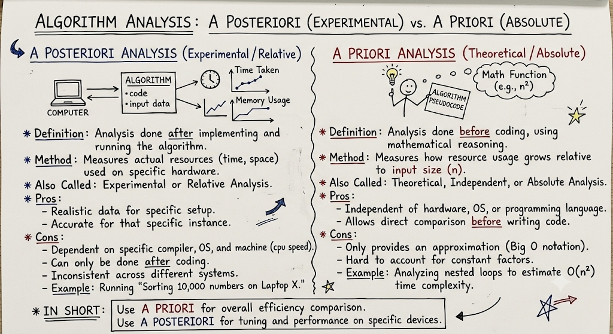

# L02 — Algorithm Complexity: Time and Space; Time-Space Tradeoff

**Unit:** 1 | **Chapter:** Fundamentals of Data Structures & Arrays | **BT Level:** BT4 | **CO:** CO1

---

## Learning Objectives

- Explain what algorithm complexity means and why it matters
- Differentiate between A Priori (theoretical) and A Posteriori (experimental) algorithm analysis
- Differentiate between time complexity and space complexity
- Analyze simple algorithms for their time and space usage
- Understand and apply the time-space tradeoff concept

---

## 1. What is Algorithm Complexity?

**Algorithm complexity** measures the resources (time and memory) an algorithm consumes relative to the size of its input, denoted **n**.

We study complexity because:
- Hardware is finite — we cannot run an O(2ⁿ) algorithm on n = 100
- Scalability matters — an algorithm working for n = 1000 may be unusable for n = 10⁶
- Complexity helps us compare algorithms **independent of hardware**

---

## 2. Approaches to Algorithm Analysis: A Priori vs. A Posteriori

Algorithm analysis can be performed at two different stages: before coding (theoretical) or after implementation (experimental).



### 2.1 Comparison Summary

| Feature | A Posteriori Analysis (Experimental / Relative) | A Priori Analysis (Theoretical / Absolute) |
|---|---|---|
| **Definition** | Analysis done **after** implementing and running the algorithm. | Analysis done **before** coding, using mathematical reasoning. |
| **Method** | Measures actual resources (time, space) used on specific hardware. | Measures how resource usage grows relative to input size (n). |
| **Also Called** | Experimental or Relative Analysis. | Theoretical, Independent, or Absolute Analysis. |
| **Pros** | • Realistic data for specific setup.<br>• Accurate for that specific instance. | • Independent of hardware, OS, or programming language.<br>• Allows direct comparison before writing code. |
| **Cons** | • Dependent on specific compiler, OS, and machine (CPU speed).<br>• Can only be done **after** coding.<br>• Inconsistent across different systems. | • Only provides an approximation (Big O notation).<br>• Hard to account for constant factors. |
| **Example** | Running "Sorting 10,000 numbers on Laptop X." | Analyzing nested loops to estimate O(n²) time complexity. |

> **In Short:**
> - Use **A Priori Analysis** for overall efficiency comparison.
> - Use **A Posteriori Analysis** for tuning and performance on specific devices.

---

## 3. Time Complexity

**Time complexity** counts the number of basic operations (comparisons, assignments, arithmetic) an algorithm performs as a function of input size n.

### 3.1 Types of Analysis

| Type | Definition | Example |
|------|-----------|---------|
| **Best Case** | Minimum operations (most favorable input) | Linear search: element is at index 0 → O(1) |
| **Worst Case** | Maximum operations (least favorable input) | Linear search: element not found → O(n) |
| **Average Case** | Expected operations over all inputs | Linear search: element at middle → O(n/2) = O(n) |

> In practice, we focus on **worst-case analysis** — it gives an upper bound guarantee.

### 3.2 Counting Operations Example

```python
# Find maximum in an array
def find_max(arr):
    max_val = arr[0]          # 1 operation
    for i in range(1, n):     # n-1 iterations
        if arr[i] > max_val:  # 1 comparison per iteration
            max_val = arr[i]  # at most 1 assignment
    return max_val            # 1 operation
```

Total operations ≈ 1 + 3(n-1) + 1 = 3n - 1 → **O(n)**

---

## 4. Space Complexity

**Space complexity** measures the amount of memory an algorithm uses relative to input size n.

It includes:
- **Input space:** Memory for storing the input
- **Auxiliary space:** Extra memory used by the algorithm (variables, stack frames, temporary arrays)

> Usually we care about **auxiliary space** (extra space beyond input).

### 4.1 Space Complexity Examples

```python
# O(1) auxiliary space — only a few variables
def sum_array(arr, n):
    total = 0
    for x in arr:
        total += x
    return total

# O(n) auxiliary space — stores a copy of input
def reverse_array(arr, n):
    result = [0] * n       # O(n) space
    for i in range(n):
        result[n-1-i] = arr[i]
    return result
```

---

## 5. Common Complexity Classes

| Notation | Name | Example |
|----------|------|---------|
| O(1) | Constant | Array access by index |
| O(log n) | Logarithmic | Binary search |
| O(n) | Linear | Linear search |
| O(n log n) | Linearithmic | Merge sort, heap sort |
| O(n²) | Quadratic | Bubble sort, insertion sort |
| O(n³) | Cubic | Naive matrix multiplication |
| O(2ⁿ) | Exponential | Subset enumeration |
| O(n!) | Factorial | Brute-force TSP |

### Growth Rate Comparison (for n = 1000):

| Complexity | Operations |
|-----------|-----------|
| O(1) | 1 |
| O(log n) | ~10 |
| O(n) | 1,000 |
| O(n log n) | ~10,000 |
| O(n²) | 1,000,000 |
| O(2ⁿ) | ~10³⁰¹ (impossible) |

---

## 6. Time-Space Tradeoff

A **time-space tradeoff** is a situation where using more memory allows an algorithm to run faster, or using less memory forces it to run slower.

> **Core idea:** You can often trade space for time or time for space depending on your system's constraints.

### 6.1 Examples of Time-Space Tradeoff

#### Example 1: Lookup Table (Memoization)
```python
# Without memoization — O(2^n) time, O(n) space (call stack)
def fib_slow(n):
    if n <= 1: return n
    return fib_slow(n-1) + fib_slow(n-2)

# With memoization — O(n) time, O(n) space
memo = {}
def fib_fast(n):
    if n in memo: return memo[n]
    if n <= 1: return n
    memo[n] = fib_fast(n-1) + fib_fast(n-2)
    return memo[n]
```

By storing previously computed results (extra O(n) space), we reduce time from O(2ⁿ) to O(n).

#### Example 2: Precomputed Prefix Sums
```python
# Without prefix sums: O(n) per query
def range_sum_slow(arr, l, r):
    return sum(arr[l:r+1])  # O(r-l+1) per query

# With prefix sums: O(n) precomputation, O(1) per query
def precompute(arr, n):
    prefix = [0] * (n+1)
    for i in range(n):
        prefix[i+1] = prefix[i] + arr[i]
    return prefix

def range_sum_fast(prefix, l, r):
    return prefix[r+1] - prefix[l]  # O(1)
```

#### Example 3: Hash Table vs Binary Search
| Approach | Space | Search Time |
|----------|-------|-------------|
| Binary Search on sorted array | O(1) extra | O(log n) |
| Hash Table | O(n) | O(1) average |

---

## 7. Factors Affecting Time Complexity

1. **Algorithm design** — the dominant factor
2. **Data structures used** — linked list vs array vs hash table
3. **Input size and characteristics** — sorted vs unsorted, dense vs sparse
4. **Platform** — interpreted vs compiled language (constant factor, not asymptotic)

---

## 8. Practical Guidelines

- Prefer **O(n log n)** over **O(n²)** for n > 10⁴
- If space is unlimited: use memoization/caching to speed up repetitive computation
- If memory is limited: accept slower algorithms or streaming approaches
- Profile before optimizing — find the real bottleneck

---

## Summary

- **A Priori vs. A Posteriori analysis:** A Priori provides hardware-independent mathematical bounds before coding; A Posteriori measures actual runtime and memory on specific hardware after execution.
- **Time complexity** measures operations as a function of n; analyzed in best, worst, and average cases.
- **Space complexity** measures memory usage (focus on auxiliary space).
- Common classes: O(1) < O(log n) < O(n) < O(n log n) < O(n²) < O(2ⁿ).
- **Time-space tradeoff:** Trading extra memory for faster execution (memoization, lookup tables, prefix sums).

---

## References

- Cormen et al., *Introduction to Algorithms*, Ch. 3 (MIT Press, 2022)
- Skiena, *The Algorithm Design Manual*, Ch. 2 (Springer, 2020)
- Laaksonen, *Guide to Competitive Programming*, Ch. 2 (Springer, 2024)

