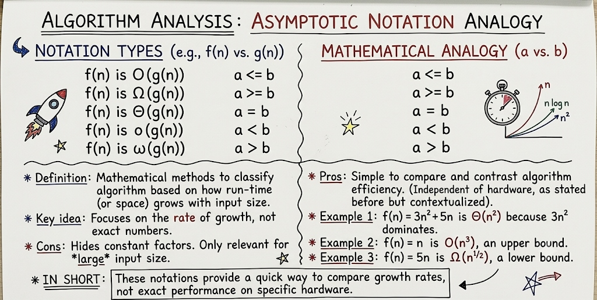

# L03 — Asymptotic Notations: Big-O, Big-Ω, Big-Θ with Examples

**Unit:** 1 | **Chapter:** Fundamentals of Data Structures & Arrays | **BT Level:** BT4 | **CO:** CO1

---

## Learning Objectives

- Define Big-O, Big-Ω, and Big-Θ notations mathematically
- Relate asymptotic notations to real-number comparisons using mathematical analogies (≤, ≥, =, <, >)
- Identify the asymptotic complexity of algorithms using each notation
- Simplify expressions using asymptotic rules
- Determine tight bounds for common algorithms

---

## 1. Why Asymptotic Analysis?

When we say an algorithm takes `3n² + 5n + 7` operations, the dominant term for large n is `n²`. Constants and lower-order terms become insignificant.

**Asymptotic analysis** describes the growth rate of a function as n → ∞, ignoring:
- Constant coefficients (hardware-dependent)
- Lower-order terms (irrelevant for large n)

---

## 2. Mathematical Analogy of Asymptotic Notations

To build an intuitive understanding, comparing two growth functions $f(n)$ and $g(n)$ is analogous to comparing two real numbers $a$ and $b$:



### 2.1 Notation vs. Real Number Analogy

| Asymptotic Notation ($f(n)$ vs. $g(n)$) | Mathematical Analogy ($a$ vs. $b$) | Intuitive Meaning | Bound Type |
|---|---|---|---|
| $f(n) \text{ is } O(g(n))$ | $a \le b$ | $f(n)$ grows **at most** as fast as $g(n)$ | Upper Bound |
| $f(n) \text{ is } \Omega(g(n))$ | $a \ge b$ | $f(n)$ grows **at least** as fast as $g(n)$ | Lower Bound |
| $f(n) \text{ is } \Theta(g(n))$ | $a = b$ | $f(n)$ grows **at the exact same rate** as $g(n)$ | Tight Bound |
| $f(n) \text{ is } o(g(n))$ | $a < b$ | $f(n)$ grows **strictly slower** than $g(n)$ | Strict Upper Bound |
| $f(n) \text{ is } \omega(g(n))$ | $a > b$ | $f(n)$ grows **strictly faster** than $g(n)$ | Strict Lower Bound |

### 2.2 Key Characteristics & Examples

- **Definition:** Mathematical methods to classify algorithms based on how run-time (or space) grows with input size.
- **Key Idea:** Focuses on the **rate of growth**, not exact operational counts.
- **Pros:** Simple to compare and contrast algorithm efficiency independently of specific hardware or operating systems.
- **Cons:** Hides constant factors; only relevant for *large* input sizes ($n$).

#### Examples:
1. **Tight Bound ($\Theta$):** $f(n) = 3n^2 + 5n$ is $\Theta(n^2)$ because $3n^2$ dominates for large $n$.
2. **Upper Bound ($O$):** $f(n) = n$ is $O(n^3)$ because $n \le n^3$ for $n \ge 1$ (valid upper bound, though not tight).
3. **Lower Bound ($\Omega$):** $f(n) = 5n$ is $\Omega(n^{1/2})$ because $5n \ge n^{1/2}$ for $n \ge 1$.

> **In Short:**
> Asymptotic notations provide a quick, hardware-independent way to compare growth rates rather than exact execution time on a specific device.

---

## 3. Big-O Notation — Upper Bound

**Definition:** f(n) = O(g(n)) if there exist positive constants c and n₀ such that:

$$f(n) \leq c \cdot g(n) \quad \forall \, n \geq n_0$$

**Interpretation:** g(n) is an **upper bound** on the growth of f(n). The algorithm runs **at most** this fast.

### 3.1 Examples

| f(n) | Big-O | Reasoning |
|------|-------|-----------|
| 3n + 5 | O(n) | 3n + 5 ≤ 4n for n ≥ 5 |
| 2n² + 3n | O(n²) | 2n² + 3n ≤ 3n² for n ≥ 3 |
| 5 | O(1) | constant, no growth |
| n log n + n | O(n log n) | n log n dominates |
| n³ + 2ⁿ | O(2ⁿ) | 2ⁿ dominates for large n |

### 3.2 Formal Verification Example

Prove that `f(n) = 4n + 2` is `O(n)`:

Choose c = 5, n₀ = 2:
- For n ≥ 2: 4n + 2 ≤ 4n + n = 5n ✓

So c = 5, n₀ = 2 satisfies the definition.

---

## 4. Big-Ω Notation — Lower Bound

**Definition:** f(n) = Ω(g(n)) if there exist positive constants c and n₀ such that:

$$f(n) \geq c \cdot g(n) \quad \forall \, n \geq n_0$$

**Interpretation:** g(n) is a **lower bound** on the growth of f(n). The algorithm takes **at least** this long.

### 4.1 Examples

| f(n) | Big-Ω | Reasoning |
|------|-------|-----------|
| 3n² + 1 | Ω(n²) | 3n² + 1 ≥ 3n² for all n ≥ 0 |
| n log n | Ω(n) | n log n ≥ n for n ≥ 2 |
| n! | Ω(2ⁿ) | n! grows faster than 2ⁿ |

### 4.2 Use Case

Ω notation is used to show **algorithmic lower bounds** — for example, any comparison-based sorting algorithm requires at least Ω(n log n) comparisons in the worst case.

---

## 5. Big-Θ Notation — Tight Bound

**Definition:** f(n) = Θ(g(n)) if:

$$c_1 \cdot g(n) \leq f(n) \leq c_2 \cdot g(n) \quad \forall \, n \geq n_0$$

**Interpretation:** g(n) is a **tight bound**. The algorithm grows **exactly as fast** as g(n) (up to constant factors).

> f(n) = Θ(g(n)) if and only if f(n) = O(g(n)) **and** f(n) = Ω(g(n))

### 5.1 Examples

| f(n) | Big-Θ | Reasoning |
|------|-------|-----------|
| 2n² + 5n | Θ(n²) | Bounded above and below by n² |
| n/2 | Θ(n) | Bounded above and below by n |
| log₂(n) + 3 | Θ(log n) | Bounded above and below by log n |

### 5.2 Formal Verification Example

Prove `f(n) = 2n + 3` is `Θ(n)`:

- **Upper bound:** 2n + 3 ≤ 3n for n ≥ 3, so f(n) = O(n) with c₂ = 3
- **Lower bound:** 2n + 3 ≥ 2n for all n ≥ 0, so f(n) = Ω(n) with c₁ = 2

Since both hold: f(n) = Θ(n) ✓

---

## 6. Summary of Notations

| Notation | Meaning | Use Case |
|----------|---------|---------|
| **O(g)** | Upper bound — "at most" | Worst-case analysis |
| **Ω(g)** | Lower bound — "at least" | Best-case analysis, proving lower bounds |
| **Θ(g)** | Tight bound — "exactly" | Average/typical behavior |

```
                  Ω(g)
                    │
f(n)  ────────────  Θ(g)  ──── both bounds equal
                    │
                  O(g)
```

---

## 7. Asymptotic Simplification Rules

### Rule 1: Drop Constants
`O(5n)` → `O(n)`, `O(100)` → `O(1)`

### Rule 2: Drop Lower-Order Terms
`O(n² + n)` → `O(n²)`, `O(n log n + n)` → `O(n log n)`

### Rule 3: Dominant Term
`O(n³ + n² + n)` → `O(n³)`

### Rule 4: Logarithm Base
`O(log₂ n) = O(log₁₀ n) = O(ln n)` — all equivalent (differ by constant factor)

### Rule 5: Sum Rule
If T₁ = O(f) and T₂ = O(g), then T₁ + T₂ = O(max(f, g))

### Rule 6: Product Rule
If T₁ = O(f) and T₂ = O(g), then T₁ × T₂ = O(f × g)

---

## 8. Worked Examples

### Example 1: Nested Loop
```python
for i in range(n):         # O(n)
    for j in range(n):     # O(n)
        print(i, j)        # O(1)
# Total: O(n × n × 1) = O(n²)
```

### Example 2: Sequential Loops
```python
for i in range(n):         # O(n)
    print(i)

for j in range(n):         # O(n)
    for k in range(n):     # O(n)
        print(j, k)
# Total: O(n) + O(n²) = O(n²)  [Sum Rule → take max]
```

### Example 3: Halving Loop
```python
i = n
while i > 0:    # How many times can we halve n before reaching 0?
    i = i // 2  # i = n, n/2, n/4, ..., 1  → log₂(n) iterations
# Total: O(log n)
```

### Example 4: Identify complexity of f(n) = 6n³ + 4n² + 2n + 100
- Dominant term: n³
- Big-O: O(n³), Big-Ω: Ω(n³), Big-Θ: Θ(n³)

---

## 9. Little-o and Little-ω (Brief Overview)

- **o(g):** Strictly less than g — f grows **strictly slower** than g (e.g., n = o(n²))
- **ω(g):** Strictly greater than g — f grows **strictly faster** than g (e.g., n² = ω(n))

These are used less frequently but appear in theoretical analysis.

---

## Summary

| Notation | Bound Type | Formal Condition | Mathematical Analogy |
|----------|-----------|-----------------|----------------------|
| O(g) | Upper | f(n) ≤ c·g(n) for n ≥ n₀ | a ≤ b |
| Ω(g) | Lower | f(n) ≥ c·g(n) for n ≥ n₀ | a ≥ b |
| Θ(g) | Tight | c₁·g(n) ≤ f(n) ≤ c₂·g(n) | a = b |
| o(g) | Strict Upper | f(n) < c·g(n) for all c | a < b |
| ω(g) | Strict Lower | f(n) > c·g(n) for all c | a > b |

- Drop constants and lower-order terms.
- Use the dominant term to determine complexity class.
- Big-Θ is the most precise — use it when both bounds match.

---

## References

- Cormen et al., *Introduction to Algorithms*, Ch. 3 (MIT Press, 2022)
- Skiena, *The Algorithm Design Manual*, Ch. 2.2 (Springer, 2020)
- Laaksonen, *Guide to Competitive Programming*, Ch. 2.1 (Springer, 2024)

